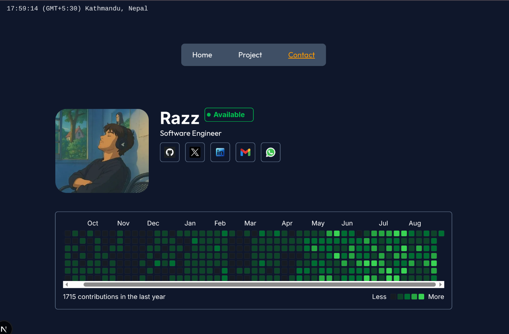

# Portfolio

A modern and responsive developer portfolio built with **Next.js, TailwindCSS, and TypeScript**.  
Showcases projects, skills, and experiences in a clean UI with fast performance.

## Screenshot



---

## ✨ Features

- ⚡ **Next.js 14 (App Router)** – Server & Client components
- 🎨 **TailwindCSS** – Custom theme & utility-first styling
- 🔤 **Google Fonts Integration** (Outfit & Ovo)
- 📱 **Responsive Design** – Mobile-first and fully adaptive
- ⚙️ **TypeScript** – Type-safe development
- 🖼️ **SVG & Image Optimization**

---

## 🛠️ Tech Stack

- Next.js – React Framework
- TailwindCSS – Styling
- TypeScript – Static Typing
- SVGR – SVG as React components

---

## 🚀 Getting Started

### 1. Clone the repository

```bash
git clone https://github.com/rajscriptsGH/Portfolio.git
cd Portfolio
```

Install dependencies

```bash
npm install
# or
yarn install
# or
pnpm install
```

Run the development server

```bash
npm run dev
# or
yarn dev
# or
pnpm dev
```

Open <http://localhost:3000>
 in your browser to see the result.

### 📂 Project Structure

```md
Portfolio/
┣ src/
 ┣ app/
 ┣ components/       # Reusable UI components
 ┣ lib/
 ┣ next.config.ts    # Next.js configuration
 ┗ tsconfig.json     # TypeScript configuration
┣ public/           # Static assets (images, icons, etc.)
```

### Customization

- Update your info in app/page.tsx and components

- Add new projects in components/FeaturedProjects.tsx

- Replace fonts in app/layout.tsx

- Change theme colors in globals.css

## 📦 Deployment

This portfolio can be easily deployed on:

Vercel
 (Recommended – seamless Next.js integration)

## 🤝 Contributing

Pull requests are welcome! If you’d like to improve the portfolio or add features, feel free to fork this repo and open a PR.

### License

This project is licensed under the MIT License.
You are free to use and modify it for your own portfolio.

### 👨‍💻 Author

Built with ❤️ by Razz

---
